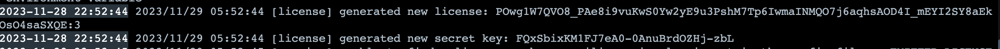

# Emitter.io Docker Configuration

This repository contains the Docker configuration for setting up an Emitter.io server

## Docker Configuration

The Dockerfile in this repository starts from the base Emitter image and includes steps to copy a custom configuration file into the image. It is configured to expose ports 8080 (http).

## Steps to Build and Run

1. **Build the Docker Image:**

    ```bash
    ./build-image.sh
    ```

2. **Run the Docker Container:**

    ```bash
    docker run -d --name emitter -p 443:443 -p 8080:8080 --platform linux/amd64 -e --restart=unless-stopped playerfirst-staging-emitter
    ```
## Editing Configuration

To use a custom configuration for Emitter.io:

1. Edit the emitter.conf file with your desired settings.

2. Generating a new license value

    a. Run 
    
    ```bash
    docker run -d --name emitter -p 8080:8080 --restart=unless-stopped emitter/server
    ```

    b. Look at the logs for `generated new license:` and `generated new secret key:` values. You will need both these values like in Figure 1.

    
    *Figure 1: New License and Secret*

    c. edit emitter.conf and update the `license` value
   
4. Generating a new channel key

    a. head to http://127.0.0.1:8080/keygen and plug in the `secret key` to get a new `channel key` 

    b. update your code with the new `channel` and `channel key` 

## Publishing to Azure Container Registry 

Below is an example of publishing the image for staging after it is built.

Login
```bash
az login
az acr login --name playerfirst
```

Tag it for publishing
```bash
docker tag playerfirst-staging-emitter playerfirst.azurecr.io/playerfirst:playerfirst-staging-emitter
```

Publish it to the repo
```bash
docker push playerfirst.azurecr.io/playerfirst:playerfirst-staging-emitter
```